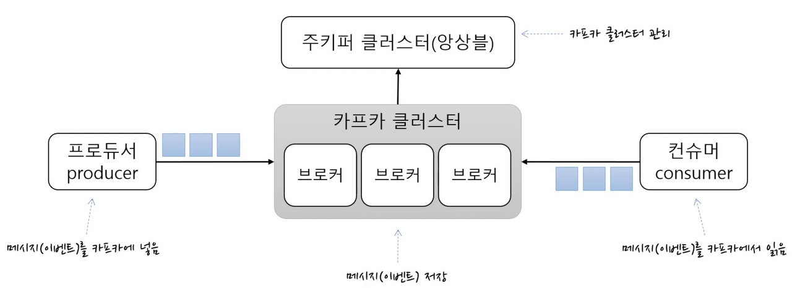
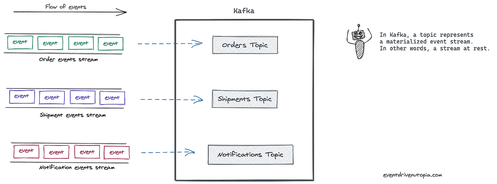

# 카프카

## 카프카란?
카프카는 오픈 소스 분산형 스트리밍 플랫폼으로, PUB-SUB 모델의 메시지 큐 형태로 동작하며 분산환경에 특화되어 있습니다.

## 카프카의 탄생 배경
카프카는 비즈니스 소셜 네트워크 서비스인 링크드인에서 개발되었습니다.

### 기존 데이터 시스템의 문제
- **시스템 복잡도의 증가**: 통합된 전송 영역이 없어 흐름 파악이 어려우며, 하나의 앱에서 문제가 발생하면 해결하기 어렵습니다.
- **데이터 파이프라인 관리의 어려움**: 각 애플리케이션과 데이터 시스템 간에 별도의 파이프라인이 존재하며, 데이터 포맷 처리가 다릅니다. 확장성이 떨어지면 유연성도 감소합니다.

> 하나의 통합된 시스템으로 데이터를 전송 가능하며, 실시간 처리 및 확장이 용이한 시스템이 필요성이 증가했습니다.

## 카프카 적용 이후
### 카프카 적용 이점
1. 모든 이벤트 처리를 중앙에서 가능하게 만듭니다.
2. 새로운 서비스가 추가되어도 카프카에서 제공하는 표준화된 포맷으로 처리하므로 유연성과 확장성이 증가합니다.
3. END TO END가 아니므로 데이터 시스템과 앱 간의 연결을 덜 신경 써도 됩니다.

## 카프카의 동작 방식
PUB-SUB 모델의 메시지 큐 형태로 동작합니다.

## 메시지 큐
메시지 지향 미들웨어를 구현한 시스템으로, 프로그램(프로세스) 간의 데이터를 교환할 때 사용하는 기술입니다.

### 구조
1. **Producer**: 메시지를 큐에 제공하는 주체.
2. **Consumer**: 메시지가 저장되는 공간.
3. **Queue**: 메시지가 저장되는 공간.

### 특징
1. **비동기 처리**: 생산자와 소비자가 동시에 활성화될 필요가 없습니다.
2. **느슨한 결합**: 시스템 간 직접적인 의존성 감소.
3. **버퍼링**: 급격한 트래픽 증가 시 완충 역할.
4. **신뢰성**: 손실 방지를 위한 지속성 보장.

## 메시지 브로커 VS 이벤트 브로커

### 메시지 브로커
- Publisher가 생산한 메시지를 메시지 큐에 저장하고, 저장된 데이터를 Consumer가 가져갈 수 있도록 중간다리 역할을 해주는 브로커입니다.
- Pub/Sub 구조이며 Redis, Rabbit MQ 등이 존재합니다. Consumer가 데이터를 가져가게 되면 짧은 시간 내에 큐에서 데이터가 삭제됩니다.

### 이벤트 브로커
- 메시지 브로커와의 차이점은 Publisher가 생산한 메시지를 바로 삭제하지 않고 저장하여, Consumer가 특정 시점부터 이벤트를 다시 Consume할 수 있습니다.
- 메시지 브로커보다 더 많은 양의 데이터를 처리할 수 있습니다.

## 카프카 구조

1. **카프카 클러스터**: Kafka Broker들의 모음으로, Broker들이 확장성과 고가용성을 위해 클러스터로 구성되어 있습니다.
2. **브로커**: 각각의 Kafka 서버로, 동일 노드에 여러 개의 브로커를 띄울 수 있습니다.
3. **ZooKeeper**: Kafka 클러스터 정보 및 분산처리 관리 등의 메타데이터를 저장합니다. Kafka를 실행하기 위해서는 필수적으로 실행해야 합니다.
4. **Producer**: 메시지를 발행하여 생산하는 앱입니다. 메시지 전송 시 Batch 처리가 가능하고, ACK 값을 통해 효율성을 조절할 수 있습니다.
   - ACK 0: Partition 리더가 받았는지 확인하지 않음.
   - ACK 1: Partition 리더가 받았는지 확인 (기본값).
   - ACK 2: Partition 리더뿐 아니라 팔로워까지 메시지를 받았는지 확인.
5. **Consumer**: 메시지를 구독하며 소비하는 주체로, Kafka Cluster에서 메시지를 읽어서 소비합니다. Batch 처리가 가능하고, 한 개의 소비자는 여러 개의 Topic을 처리할 수 있습니다.
6. **Topic**: Kafka에서 메시지를 구분하는 기본 단위로, 특정 카테고리 또는 데이터 스트림을 나타냅니다. 하나의 Topic은 여러 파티션으로 나뉘어 있으며, 각 파티션은 독립적으로 메시지를 저장하고 처리합니다. Producer는 특정 Topic에 메시지를 발행하고, Consumer는 특정 Topic을 구독하여 메시지를 소비합니다.
   
7. **Partition**: Topic의 데이터를 여러 개로 나누어 저장하는 단위로, 각 파티션은 순서대로 메시지를 저장합니다. 각 파티션은 Kafka 클러스터의 브로커에 분산되어 저장되며, 파티션을 통해 수평적으로 확장 가능합니다. 각 파티션의 메시지는 고유한 오프셋(순서 번호)을 가지며, Consumer는 이 오프셋을 기반으로 메시지를 읽습니다. 데이터의 병렬 처리를 가능하게 하여 높은 처리량을 지원합니다.

## Offset
- **Offset**: Kafka에서 각 메시지는 고유한 숫자 값인 오프셋을 가집니다. 이 오프셋은 특정 Partition 내에서 메시지가 저장된 순서를 나타내는 지표입니다.
- **순서 보장**: 각 Partition 내의 메시지는 오프셋을 기준으로 순서대로 배치됩니다. 예를 들어, Partition의 첫 번째 메시지는 오프셋 0을 가지고, 두 번째 메시지는 오프셋 1을 가집니다. 이 방식으로 메시지의 순서를 관리하고, 소비자는 이 오프셋을 통해 원하는 메시지를 읽어올 수 있습니다.
- **소비 위치 관리**: Consumer는 각 Partition에서 읽은 마지막 메시지의 오프셋을 저장하여, 다음에 메시지를 소비할 때 어디서부터 읽어야 할지를 결정합니다. 이를 통해 Consumer는 중단된 위치에서 다시 메시지를 읽어들일 수 있습니다.
- **자동 커밋 및 수동 커밋**: Kafka에서는 메시지를 소비한 후 오프셋을 자동으로 저장하는 **자동 커밋** 기능이 있습니다. 반면, 필요에 따라 수동으로 커밋할 수도 있습니다. 수동 커밋은 더 정교한 소비 제어를 가능하게 하며, 메시지를 안전하게 처리하기 위해 실패 시 다시 읽어들일 수 있도록 합니다.
- **오프셋 관리**: Kafka는 기본적으로 Consumer Group 별로 오프셋을 관리합니다. 즉, 각 Consumer Group은 자신의 오프셋을 독립적으로 관리하며, 여러 Consumer Group이 동일한 Topic을 소비할 수 있습니다. 이를 통해 각 그룹은 서로 다른 소비 위치에서 시작할 수 있습니다.

## Consumer Group
- **Consumer Group**: 여러 Consumer들이 논리적으로 묶여서 특정 Topic의 메시지를 소비하는 그룹입니다. Consumer Group 내의 Consumer들은 함께 협력하여 메시지를 소비하게 됩니다.
- **메시지 분산 소비**: Consumer Group 내의 각 Consumer는 서로 다른 Partition을 소비함으로써, 전체 Topic의 메시지를 병렬로 처리할 수 있습니다. 이를 통해 데이터 처리의 효율성을 높이고, 부하를 분산시킬 수 있습니다.
- **1:N 매칭 관계**: 각 Partition은 Consumer Group 내의 단 하나의 Consumer와만 연결될 수 있습니다. 이로 인해, 특정 Partition의 메시지는 오직 하나의 Consumer에 의해 소비되며, 그 Partition 내의 메시지 순서가 보장됩니다.
- **메시지 처리의 독립성**: 여러 Consumer Group이 동일한 Topic을 소비할 수 있으며, 각 Group은 독립적으로 오프셋을 관리합니다. 즉, A라는 Consumer Group이 Topic의 메시지를 소비하고 있을 때, B라는 다른 Consumer Group이 동일한 Topic의 메시지를 독립적으로 소비할 수 있습니다. 이로 인해 다양한 소비 시나리오에 유연하게 대응할 수 있습니다.
- **장애 복구**: Consumer Group은 장애 복구에 유리한 구조를 가지고 있습니다. 특정 Consumer가 실패하더라도, 같은 Consumer Group 내의 다른 Consumer가 그 Partition의 메시지를 대신 소비할 수 있어 시스템의 신뢰성을 높입니다.

## 1. 왜 하나의 Topic을 여러 개의 Partition으로 나눌까?
Topic은 Producer가 발행한 이벤트가 모이는 하나의 단위입니다. 그러므로 Topic을 여러 Partition으로 나누는 이유는 다음과 같습니다.

👨‍💻 **많은 양의 이벤트를 병렬로 처리하기 위해 분산 처리합니다.**

실제로 Kafka가 사용되는 애플리케이션에서는 동시에 엄청나게 많은 양의 이벤트가 Kafka Broker에 Produce(Write)되며, 동시에 Consumer에 의해 Consume(Read)될 수 있습니다. 만약 Topic 안에 하나의 메시지 큐(Partition)가 존재한다면 병목 현상이 발생할 수 있습니다. 따라서 효율적인 이벤트 분산 처리를 위해 Partition을 여러 개 두어 병렬 방식을 통해 분산 처리합니다.

단, 한 번 늘린 Partition은 절대 줄일 수 없기 때문에 운영 중에 Partition을 늘리는 것은 충분히 검토 후에 실행되어야 합니다. 또한, Partition을 늘렸을 때 메시지는 Round-Robin 방식으로 쓰여지므로 하나의 Partition 내에서는 메시지 순서가 보장되지만, Partition이 여러 개인 경우 순서는 보장되지 않습니다❗️

> **결론**: 최소한의 Partition으로 운영하고, 사용량에 따라 필요 시 늘리자.
> Kafka에서 메시지 순서는 개별 Partition 내에서는 보장되지만, 여러 Partition을 사용하는 경우 전체적인 메시지 순서는 보장되지 않는다.

## 2. Consumer Group이 왜 존재할까?
Consumer Group은 하나의 Topic에 대한 책임을 집니다. 즉, 어떤 Consumer가 다운되면 Partition Rebalancing을 통해 다른 Consumer가 해당 Partition의 Consume을 맡아야 합니다. 이를 위해 Consumer Group이 존재합니다.

- **Offset 공유**: Partition에서 어디까지 소비했는지에 대한 정보인 Offset은 Consumer Group에서 공유됩니다. 따라서 다운된 Consumer를 대체하는 다른 Consumer는 정상적으로 이어서 이벤트를 소비할 수 있습니다❗️
