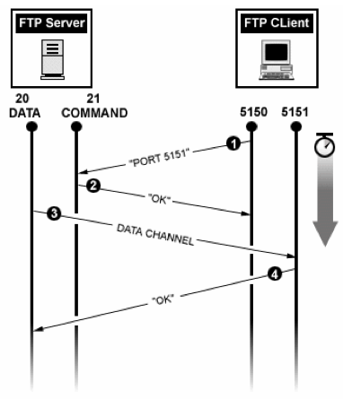
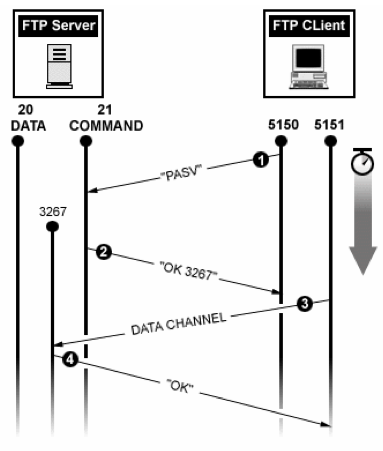

# FTP (File Transfer Protocol)

FTP(File Transfer Protocol)는 하나의 호스트에서 다른 호스트로 파일을 복사하기 위해 사용하는 표준 통신 프로토콜로, TCP/IP 네트워크에서 주로 사용됩니다. 웹 서버, 파일 서버, 클라우드 서비스 등에서 파일 전송 목적으로 많이 활용되며, 두 가지 주요 전송 방식인 능동(Active) 및 수동(Passive) 모드를 지원합니다.

## FTP의 기본 구조

FTP는 **제어 채널**과 **데이터 채널**로 구성됩니다. 제어 채널은 명령어와 응답을 주고받기 위해 **21번 포트**를 사용하고, 데이터 채널은 실제 파일을 전송하기 위해 **20번 포트**를 사용합니다. 이러한 구조 덕분에 제어와 데이터 전송이 별도의 채널에서 이루어집니다.

> **주의사항:** FTP는 암호화되지 않은 평문 전송을 수행하기 때문에 데이터가 노출될 가능성이 있습니다. 보안을 위해 **SFTP**(22번 포트 사용) 또는 **FTPS**(990번 포트 사용)와 같은 보안 전송 프로토콜을 사용하는 것이 좋습니다.

---

## FTP 전송 모드

기본적으로 FTP는 **Active Mode**로 작동하지만, 클라이언트는 **Active Mode** 또는 **Passive Mode**를 선택할 수 있습니다. 각 모드는 데이터 포트 연결 방식이 달라 방화벽 환경에 따라 적절한 모드를 선택하는 것이 중요합니다.

### 1) 능동 연결 (Active Mode)

**Active Mode**는 서버가 클라이언트로 직접 연결하여 데이터 채널을 생성하는 방식입니다. 작동 방식은 다음과 같습니다.

1. **제어 채널 생성**  
   클라이언트가 서버의 **21번 포트**로 접속해 제어 채널을 생성합니다. 이후 파일 조회 명령어(`ls` 등)를 입력하면, 클라이언트는 **데이터 전송 포트**(일반적으로 **1024 이상 포트**)를 서버에 알려줍니다.

2. **서버 응답 (ACK)**  
   서버는 클라이언트의 요청을 수락하고, **ACK** 응답을 보냅니다.

3. **데이터 채널 생성**  
   서버의 **20번 포트**는 클라이언트가 지정한 두 번째 포트로 연결하여 데이터 채널을 생성합니다.

4. **데이터 송수신**  
   파일 요청이 있다면 서버가 이 채널을 통해 파일을 전송하고, 전송이 완료되면 채널을 닫습니다.
  
  
출처 : https://peemangit.tistory.com/66
> **주의사항:** Active Mode에서는 서버가 클라이언트로 직접 연결하므로, 클라이언트 측 방화벽이 외부 요청을 차단할 경우 데이터 채널 연결이 불가능해 파일을 받을 수 없는 문제가 발생할 수 있습니다.

---

### 2) 수동 연결 (Passive Mode)

**Passive Mode**는 서버가 클라이언트의 요청을 기다리는 방식으로, 클라이언트가 데이터 전송에 적합하도록 서버와 연결합니다. Passive Mode의 작동 방식은 다음과 같습니다.

1. **제어 채널 생성**  
   클라이언트가 서버의 **21번 포트**에 접속해 제어 채널을 생성합니다. 이후 클라이언트는 **`PASV` 명령**을 서버에 전송해 Passive Mode로 전환합니다.

2. **서버 포트 알림**  
   서버는 사용 가능한 임의의 비특권 포트(예: **3267**) 번호를 클라이언트에게 전달합니다.

3. **데이터 채널 생성**  
   클라이언트는 서버가 지정한 포트로 접속해 데이터 채널을 생성합니다.

4. **데이터 송수신**  
   데이터 전송이 완료되면 서버는 ACK 응답을 보내며 데이터 채널을 종료합니다.

  
출처 : https://peemangit.tistory.com/66
> **Passive Mode 장점:** 서버가 데이터 포트를 알려주기 때문에, 클라이언트 측에서 방화벽 설정으로 해당 포트 범위만 열어두면 됩니다. Active Mode와 달리 방화벽 문제로 인한 데이터 연결 장애가 발생하지 않는 경우가 많습니다.

---

## FTP 전송 모드 선택 팁

* **Active Mode**는 서버가 클라이언트로 직접 연결해 데이터를 전송할 수 있을 때 유리하며, 기본 전송 모드로 많이 사용됩니다.
* **Passive Mode**는 클라이언트가 방화벽 뒤에 있는 경우 유리하며, FTP를 통한 외부 접속이 제한되는 환경에서 많이 사용됩니다. 대부분의 웹 브라우저는 `ftp://` 형식의 FTP 접속 시 Passive Mode만을 지원합니다.
